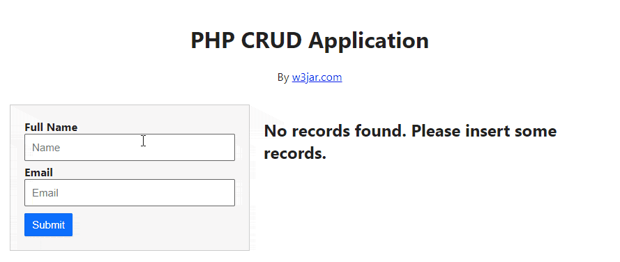

# Crud PHP con MySQL (Vistas)

  

Vistas a utilizarse para llevar a cabo practica de la elaboración de un crud con PHP y MySQL, esto con la intención de enfocar los esfuerzos unicamente en programar la aplicación y  ya no tanto en la maquetación del mismo.

## Instrucciones:
- clona el repositorio
- Modifica los archivos de manera adecuada
- Montalo en un servidor web local o en un hosting
- Accede a tu sitio web =)

### Have some fun